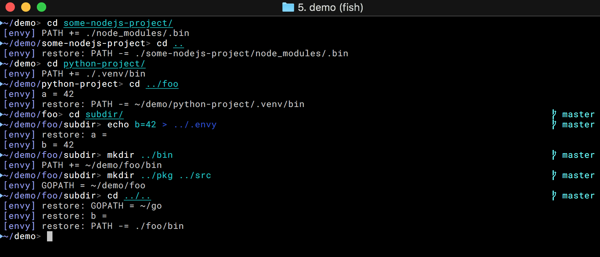

# Envy

Envy is a shell helper program that automatically sets environment variables
when you enter certain directories, and properly undoes its actions when you
leave them.

It executes very fast (typically in about 10 ms) every time when your shell 
([bash], [zsh] or [fish]) is about to print its prompt. Unlike
many tools written in Python or shell script, it will not make your
shell feel sluggish, and upgrading Python will not break your shell.

Envy can be used to replace the shell integration part of tools like [pyenv],
[nvm] and [asdf]. It sets environment variables with the root of the current
git repository and the active branch without executing git, which you can 
use to customize your shell prompt. It also loads custom environment variables
from local `.envy` files.

## Screenshot




## Installation

### macOS

Mac users can use [Homebrew] to quickly install the binary release (no compilation required):

    $ brew install wojas/tap/envy

### Binary releases

Binary packages can be found on the [Github Releases page].

### Install from source

To install from source, you need to have [Go] 1.10 installed and `GOPATH` set. Then run:

    $ go install github.com/wojas/envy


## Configuring your shell

In order to use envy, simply add the following to your `~/.zshrc`:

```bash
function precmd { eval $(envy session); }
```

or `~/.bashrc`:
```bash
function envyprecmd { eval $(envy session); }
PROMPT_COMMAND="envyprecmd"
```

[Fish] users can create a `~/.config/fish/conf.d/envy.fish` file with the following contents:

```fish
function _envy_fish_prompt_event --on-event fish_prompt
    eval (envy -fish session)
end
```

## Usage

Envy will automatically:

* Add any `bin`, `.venv/bin` (Python) and `node_modules/.bin` directory in your current
  working directory, or in one of the directories higher up, to your PATH.
* Set a path as the `GOPATH` if it contains a `bin`, `pkg` and `src` directory.
* Set all environment variables defined in `.envy` files.
* Set `_ENVY_GITROOT` and `_ENVY_BRANCH` when you enter a git repository.
* Correctly undo all relevant changes when you leave the directories.

For safety, envy currently only performs these actions for directories nested 
under your home directory. This will be made configurable in a future release.

The `.envy` files have the same format as `.env` files, but some environment variables
are handled specially:

- `ENVY_EXTEND_PATH` extends you `PATH` with the given `:` separated paths.
- `ENVY_GOROOT` sets the path as your `GOROOT` and adds `$GOROOT/bin` to your `PATH`.

Example `.envy` file:

```
FOO=bar
# This sets GOROOT and adds the bin directory to PATH
ENVY_GOROOT=~/sdk/go1.10
# Note that you can specify these relative to your current dir
ENVY_EXTEND_PATH=/some/path/bin:./other/path/bin
```

Values can be quoted, but this is not required. 

## FAQ

### Q: Does envy automatically load .env files?

Originally it did, but I found that this has too many undesired side effects:

- You can no longer easily override a variable in your shell session.
- Tools like Docker Compose then treat file paths like `COMPOSE_FILE` relative
  to your current directory, instead of relative to the directory that contains 
  your `docker-compose.yml`.

If you really want to load a `.env` file, you can symlink it to `.envy`.


[bash]: https://www.gnu.org/software/bash/
[zsh]: http://www.zsh.org/
[fish]: https://fishshell.com/
[pyenv]: https://github.com/pyenv/pyenv
[nvm]: https://github.com/creationix/nvm
[asdf]: https://github.com/asdf-vm/asdf
[Homebrew]: https://brew.sh/
[Go]: https://golang.org/dl/
[Github Releases page]: https://github.com/wojas/envy/releases
